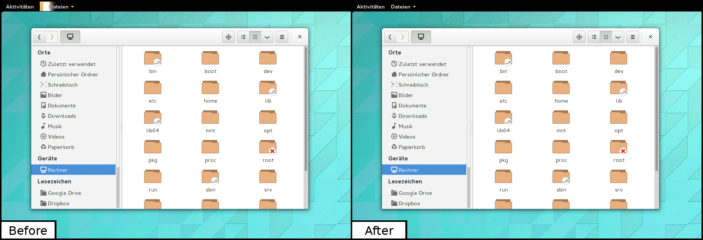

# GNOME Shell Extension - Hide App Icon

The GNOME Shell Extension "Hide App Icon" allows to hide the icon and/or title of the currently focused application in the top panel of the GNOME shell.



## Download and Installation

This extension is available at the GNOME's official extensions website at https://extensions.gnome.org/extension/810/hide-app-icon. If you have the "GNOME Shell-Integration" plugin installed in your browser, the extension can easily be installed from within the browser.

Alternatively it is possible to download the latest release as a zip archive at https://github.com/michael-rapp/gnome-shell-extension-hide-app-icon/releases. Once downloaded, the extension can be installed by executing the following commands in a terminal:

```
  $ unzip gnome-shell-extension-title-to-panel-v*.zip 
  $ cd hide-app-icon@mrapp.sourceforge.com
  $ make install
```

Executing the makefile automatically copies all relevant files into the directory `~/.local/share/gnome-shell/extensions`. If a prior version of the extension is already installed it is replaced.

In order to enable the extension an application such like "Gnome Tweak Tool" may be used.

## License Agreement

This project is distributed under the GNU General Public License version 3.0. For further information about this license agreement's content please refer to its full version, which is available at https://www.gnu.org/licenses/gpl.txt.

## Contact Information

For personal feedback or questions feel free to contact me via the mail address, which is mentioned on my [Github profile](https://github.com/michael-rapp). If you have found any bugs or want to post a feature request please use the [bugtracker](https://github.com/michael-rapp/gnome-shell-extension-hide-app-icon/issues) to report them.